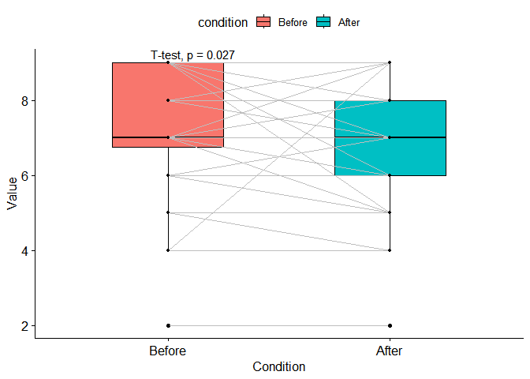
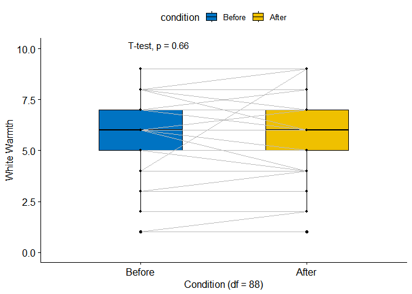
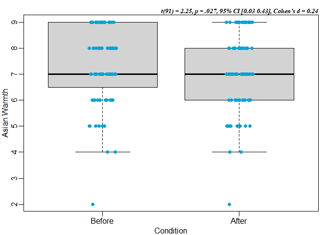
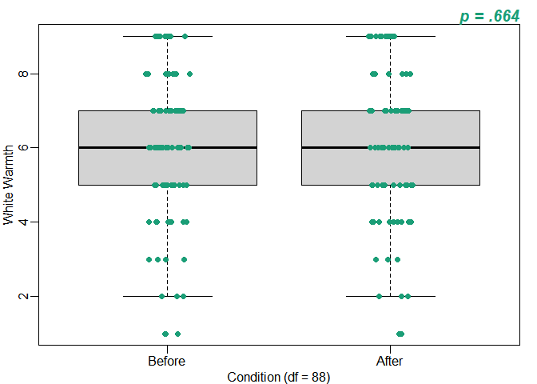

Po 1- Boxplots
================
Colin Li
1/17/2023

``` r
library(haven)
library(dplyr)
```

    ## 
    ## Attaching package: 'dplyr'

    ## The following objects are masked from 'package:stats':
    ## 
    ##     filter, lag

    ## The following objects are masked from 'package:base':
    ## 
    ##     intersect, setdiff, setequal, union

``` r
library(effsize)
library(rstatix)
```

    ## 
    ## Attaching package: 'rstatix'

    ## The following object is masked from 'package:stats':
    ## 
    ##     filter

``` r
Adata <- read_sav("C:/Users/Colin/Documents/GitHub/po1/AQ.sav")
Adf <- Adata %>% 
  filter(Asian == "1" & Conditions == "Ingroup")

t.test(Adf$Q95, Adf$Asian_Warmth, paired = TRUE, alternative = "two.sided") 
```

    ## 
    ##  Paired t-test
    ## 
    ## data:  Adf$Q95 and Adf$Asian_Warmth
    ## t = 2.2494, df = 91, p-value = 0.0269
    ## alternative hypothesis: true mean difference is not equal to 0
    ## 95 percent confidence interval:
    ##  0.02669492 0.42982682
    ## sample estimates:
    ## mean difference 
    ##       0.2282609

``` r
Wdf <- Adata %>%
  filter(Asian == "1" & Conditions == "Outgroup")

t.test(Wdf$Q96, Wdf$White_Warmth, paired = TRUE, alternative = "two.sided")
```

    ## 
    ##  Paired t-test
    ## 
    ## data:  Wdf$Q96 and Wdf$White_Warmth
    ## t = -0.4356, df = 88, p-value = 0.6642
    ## alternative hypothesis: true mean difference is not equal to 0
    ## 95 percent confidence interval:
    ##  -0.1874901  0.1200743
    ## sample estimates:
    ## mean difference 
    ##     -0.03370787

\#before and after attitude toward Asians

``` r
library(ggplot2)
library(ggpubr)
Before <-Adf$Q95
After <-Adf$Asian_Warmth
Adf2 <- data.frame(Before = Before, After = After)
         ggpaired(Adf2, cond1 = "Before", cond2 = "After",
         fill = "condition", line.color = "gray", line.size = 0.3,
         palette = "jco", xlab = "Condition", ylab = "Asian Warmth", caption = "t(91) = 2.25, 95% CI [0.03 0.43], Cohen's d = 0.24
") +      scale_y_continuous(limit = c(0, 10)) +
 stat_compare_means(vjust = 0.5, method = "t.test", paired = TRUE)
```

    ## Warning: `gather_()` was deprecated in tidyr 1.2.0.
    ## ℹ Please use `gather()` instead.
    ## ℹ The deprecated feature was likely used in the ggpubr package.
    ##   Please report the issue at <]8;;https://github.com/kassambara/ggpubr/issueshttps://github.com/kassambara/ggpubr/issues]8;;>.

    ## Warning: attributes are not identical across measure variables;
    ## they will be dropped

<!-- -->

\#before and after attitude toward Whites

``` r
library(ggplot2)
library(ggpubr)
Before <-Wdf$Q96
After <-Wdf$White_Warmth
Wdf2 <- data.frame(Before = Before, After = After)
Wdf2 <- Wdf2[complete.cases(Wdf2),]
         ggpaired(Wdf2, cond1 = "Before", cond2 = "After",
         fill = "condition", line.color = "gray", line.size = 0.3,
         palette = "jco", xlab = "Condition", ylab = "White Warmth", caption = "t(88) = -0.44, 95% CI [-0.19, 0.12], Cohen's d = -0.05
") +
                      scale_y_continuous(limit = c(0, 10)) +
 stat_compare_means(vjust = 0.5, method = "t.test", paired = TRUE, na.rm = TRUE)
```

    ## Warning: attributes are not identical across measure variables;
    ## they will be dropped

<!-- --> \#Asian
attitude–a different style boxplot

``` r
library(tidyverse)
```

    ## ── Attaching packages ─────────────────────────────────────── tidyverse 1.3.2 ──
    ## ✔ tibble  3.1.8     ✔ purrr   0.3.5
    ## ✔ tidyr   1.2.1     ✔ stringr 1.5.0
    ## ✔ readr   2.1.3     ✔ forcats 0.5.2
    ## ── Conflicts ────────────────────────────────────────── tidyverse_conflicts() ──
    ## ✖ rstatix::filter() masks dplyr::filter(), stats::filter()
    ## ✖ dplyr::lag()      masks stats::lag()

``` r
library(rafalib)

mypar(1,1)
dat <- list(Before=Adf$Q95, After=Adf$Asian_Warmth)
dat %>%
   boxplot(xlab = "Condition",
           ylab = "Asian Warmth",
           cex = 0)
 dat %>%
   stripchart(
     vertical = TRUE,
     method = "jitter",
     pch = 16,
     add = TRUE,
     col = "#02a4d3"
   ) 
mtext(text="t(91) = 2.25, p = .027, 95% CI [0.03 0.43], Cohen's d = 0.24", side = 3, adj = 1, col = "black", cex = 0.8, font = 9)
```

<!-- --> \#White
attitude–a different style boxplot

``` r
library(tidyverse)
library(rafalib)

mypar(1,1)
list(Wdf)
```

    ## [[1]]
    ## # A tibble: 90 × 42
    ##    Q95      Q96     Q97   Q98   Q114    Q130    Q130_…¹ Q135_1  Q135_2   Q135_3 
    ##    <dbl+lb> <dbl+l> <dbl> <dbl> <dbl+l> <dbl+l> <chr>   <dbl+l> <dbl+lb> <dbl+l>
    ##  1 6 [60° … 6 [60°… NA    NA    5 [5]   5 [The… ""      2 [A L…  2 [A L… 1 [Ver…
    ##  2 9 [100°… 4 [40°… NA    NA    4 [4]   6 [The… ""      4 [Qui… NA       3 [Mod…
    ##  3 9 [100°… 6 [60°… NA    NA    3 [3]   5 [The… ""      2 [A L…  2 [A L… 2 [A L…
    ##  4 6 [60° … 5 [50°… NA    NA    4 [4]   6 [The… ""      3 [Mod…  2 [A L… 1 [Ver…
    ##  5 8 [85° … 7 [70°… NA    NA    4 [4]   7 [Som… ""      1 [Ver…  1 [Ver… 1 [Ver…
    ##  6 9 [100°… 3 [30°… NA    NA    5 [5]   6 [The… ""      2 [A L…  2 [A L… 3 [Mod…
    ##  7 8 [85° … 7 [70°… NA    NA    3 [3]   6 [The… ""      1 [Ver…  1 [Ver… 1 [Ver…
    ##  8 8 [85° … 6 [60°… NA    NA    4 [4]   5 [The… ""      2 [A L…  4 [Qui… 1 [Ver…
    ##  9 6 [60° … 6 [60°… NA    NA    3 [3]   4 [The… ""      3 [Mod…  2 [A L… 1 [Ver…
    ## 10 6 [60° … 6 [60°… NA    NA    6 [6 =… 5 [The… ""      1 [Ver…  1 [Ver… 1 [Ver…
    ## # … with 80 more rows, 32 more variables: Q135_4 <dbl+lbl>, Q135_5 <dbl+lbl>,
    ## #   Q135_6 <dbl+lbl>, Q135_7 <dbl+lbl>, Q135_8 <dbl+lbl>, Q135_9 <dbl+lbl>,
    ## #   Q135_10 <dbl+lbl>, Q127 <dbl+lbl>, Q128 <dbl+lbl>, condition <dbl+lbl>,
    ## #   Distressed <dbl>, Upset <dbl>, Guilty <dbl>, Scared <dbl>, Hostile <dbl>,
    ## #   Irritable <dbl>, Ashamed <dbl>, Nervous <dbl>, Jittery <dbl>, Afriad <dbl>,
    ## #   NegEmo <dbl>, Expectation <dbl>, White_Warmth <dbl>, Asian_Warmth <dbl>,
    ## #   Centrality <dbl>, Centrality_meancentered <dbl>, …

``` r
Wdf2 %>%
   boxplot(xlab = "Condition",
           ylab = "White Warmth",
           cex = 0)
 Wdf2 %>%
   stripchart(
     vertical = TRUE,
     method = "jitter",
     pch = 16,
     add = TRUE,
     col = "#02a4d3"
   )
mtext(text= "t(88) = -0.44, p = .664, 95% CI [-0.19, 0.12], Cohen's d = -0.05", side = 3, adj = 1, col = "black", cex = 0.8, font = 9)
```

<!-- -->
